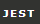

# Hey, I'm Lucas Vitiello a developer
I have been a programmer for 3.5 years, constantly seeking to learn and develop new projects to expand my knowledge and enrich my GitHub portfolio. My social media, portfolio, professional experiences with technologies, and contact information are listed below.

## My page with projects I developed
<a href="https://vitiello-portfolio.vercel.app/" target="_blank">https://vitiello-portfolio.vercel.app/</a>

## Technologies I've worked on

  
click to show more

   
  

    
      
      
    
    
    
    
    
    
    
    
    
    
    
    
    
    
    
    
    
    
    
    
    
    
           
  

## Technologies I work on

  
  
  
  
    
    
  
  
  
  
  
  
    
    
    
    
        

## Git Status

  <a href="https://github.com/vitielloL"/>
  <!--  -->
  
  

## Contacts

  
  
  

